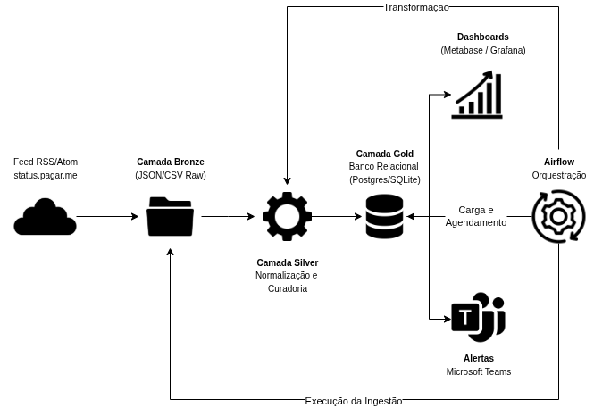

# Pagar.me Status Pipeline

Este repositório contém um pipeline de engenharia de dados desenvolvido para coletar e analisar os incidentes publicados no site [status.pagar.me](https://status.pagar.me).  

O motivo da criação deste pipeline foi a **necessidade do time do produto Mercadapp em que atuo monitorar a disponibilidade da Pagar.me**, garantindo visibilidade rápida em casos de instabilidade ou queda dos serviços. Antes, a equipe precisava acessar manualmente a página de status, o que atrasava a comunicação. Com este pipeline, os incidentes são armazenados de forma estruturada, analisados historicamente e comunicados automaticamente ao time via Microsoft Teams.

O objetivo é estruturar os dados em diferentes camadas (Bronze, Silver e Gold), disponibilizar análises históricas de disponibilidade e incidentes, e enviar alertas automáticos para o Microsoft Teams.

---


## Arquitetura

A arquitetura do pipeline segue o modelo em camadas, com ingestão, transformação, armazenamento e consumo:



1. **Coleta (Extract)**: os dados são obtidos do feed RSS/Atom do site de status da Pagar.me.  
2. **Armazenamento em Bronze**: os dados são salvos no formato bruto (JSON/CSV), preservando o histórico.  
3. **Transformação (Silver)**: os registros são normalizados, tratados contra duplicidade e enriquecidos com metadados.  
4. **Carga (Gold)**: os dados tratados são carregados em um banco relacional para análises e dashboards.  
5. **Consumo**: os dados são utilizados para relatórios em Metabase/Grafana e alertas automatizados via Teams.

---

## Estrutura de Diretórios

```
pagarme-status-pipeline/
│── dags/                  # DAGs do Airflow
│   └── pagarme_status_dag.py
│
│── etl/                   # Scripts ETL (Extract, Transform, Load)
│   ├── extract.py
│   ├── transform.py
│   └── load.py
│
│── db/                    # Banco de dados e schema
│   ├── schema.sql
│   └── init_db.py
│
│── data/                  # Data Lake local
│   ├── bronze/            # Dados crus
│   ├── silver/            # Dados tratados
│   └── gold/              # Dados prontos para análise
│
│── alerts/                # Notificações
│   └── teams_bot.py
│
│── dashboards/            # Consultas e relatórios
│   └── queries.sql
│
│── logs/                  # Logs de execução
│
│── tests/                 # Testes unitários
│   └── test_extract.py
│
│── requirements.txt       # Dependências do projeto
│── README.md              # Documentação
```

---

## Pré-requisitos

- Python 3.9 ou superior  
- Pip ou Poetry para gerenciamento de dependências  
- Banco de dados PostgreSQL ou SQLite (para ambiente local)  
- Microsoft Teams com webhook configurado (para alertas)  

---

## Instalação

Clone o repositório e instale as dependências:

```bash
git clone https://github.com/seuusuario/pagarme-status-pipeline.git
cd pagarme-status-pipeline
pip install -r requirements.txt
```

---

## Execução Local

1. **Coletar dados (Bronze):**
```bash
python etl/extract.py
```

2. **Transformar dados (Silver):**
```bash
python etl/transform.py
```

3. **Carregar no banco (Gold):**
```bash
python etl/load.py
```

4. **Enviar alerta no Teams:**
```bash
python alerts/teams_bot.py
```

---

## Orquestração com Airflow

A DAG `pagarme_status_dag.py` define o fluxo de execução automático.  
Para rodar no Airflow:

```bash
airflow standalone
```

Depois, ative a DAG no painel web do Airflow.

---

## Dashboards

Os dados da camada Gold podem ser conectados a ferramentas de BI como Metabase ou Grafana.  
O arquivo `dashboards/queries.sql` contém exemplos de consultas para análise:

- Incidentes por mês  
- Tempo médio de resolução (MTTR)  
- Serviços mais afetados  

---

## Roadmap

- [ ] Criar docker-compose para ambiente local (Postgres + Airflow + Metabase)  
- [ ] Adicionar testes automatizados para validação de dados  
- [ ] Criar integração com Power BI  
- [ ] Expandir para outras fontes de status (Stripe, AWS, etc.)  

---

## Licença

Este projeto é distribuído sob a licença MIT. Consulte o arquivo LICENSE para mais detalhes.